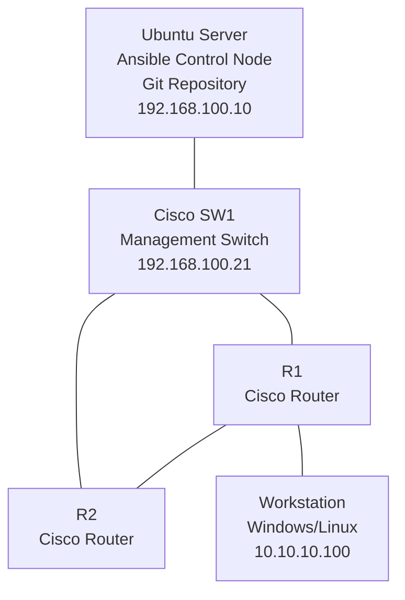

# Labra: Cisco-verkon automaatio Ansiblella

## Tavoite

Laboratorion tavoitteena on opetella:

- Verkkolaitteiden hallintaa SSH-yhteydellä
- Ansible-inventaarion käyttöä
- Cisco IOS -laitteiden automaattista konfigurointia
- Konfiguraatioiden varmistamista (backup)
- Konfiguraatioiden versionhallintaa Gitillä
- Muutosten palauttamista aiempaan tilaan



---

# Fyysiset laitteet

## Hallintapalvelin

- Ubuntu Server 24.04
- Ansible
- Git
- VS Code (valinnainen)
- Python3

## Verkkolaitteet

- Cisco Router R1
- Cisco Router R2
- Cisco Switch SW1

## Työasema

- Windows 11 tai Linux
- SSH-client
- selain

---

# IP-suunnitelma

## Hallintaverkko

Verkon tarkoitus on mahdollistaa Ansible-hallinta.

| Laite | Osoite |
|---------|---------|
| Ansible Server | 192.168.100.10/24 |
| SW1 | 192.168.100.21/24 |
| R1 | 192.168.100.11/24 |
| R2 | 192.168.100.12/24 |
| Gateway | Ei tarvita |

---

## Reitittimien välinen yhteys

| Laite | Interface | Osoite |
|---------|---------|---------|
| R1 | G0/1 | 172.16.0.1/30 |
| R2 | G0/1 | 172.16.0.2/30 |

---

## Käyttäjäverkko

| Laite | Interface | Osoite |
|---------|---------|---------|
| R1 | G0/0 | 10.10.10.1/24 |
| Workstation | NIC | 10.10.10.100/24 |

---

# Topologian looginen rakenne

```text

Management Network

192.168.100.0/24

 Ansible
    |
    |
   SW1
  /   \
 R1   R2


Data Network

10.10.10.0/24
      |
      |
      R1
      |
172.16.0.0/30
      |
      R2

```

---

# Cisco-laitteiden peruskonfiguraatio

## SSH:n käyttöönotto

Suoritetaan molemmille reitittimille.

```cisco
hostname R1

ip domain-name lab.local

crypto key generate rsa modulus 2048

username admin privilege 15 secret Salainen123

line vty 0 4
 login local
 transport input ssh

ip ssh version 2
```

---

## Hallintaosoitteet

### R1

```cisco
interface g0/0
 ip address 10.10.10.1 255.255.255.0
 no shutdown

interface g0/1
 ip address 172.16.0.1 255.255.255.252
 no shutdown

interface vlan 1
 ip address 192.168.100.11 255.255.255.0
 no shutdown
```

### R2

```cisco
interface g0/1
 ip address 172.16.0.2 255.255.255.252
 no shutdown

interface vlan 1
 ip address 192.168.100.12 255.255.255.0
 no shutdown
```

---

# Ansible-palvelimen valmistelu

## Tarvittavat paketit

```bash
sudo apt update

sudo apt install -y \
    git \
    python3-pip

pip install ansible

ansible-galaxy collection install cisco.ios
```

---

# Projektirakenne

```text
network-automation/

├── inventory
│   └── hosts.yml
│
├── playbooks
│   ├── backup.yml
│   ├── hostname.yml
│   ├── facts.yml
│   └── restore.yml
│
├── backups
│
└── README.md
```

---

# Inventaario

Tiedosto:

```yaml
# inventory/hosts.yml

all:
  children:
    routers:
      hosts:
        r1:
          ansible_host: 192.168.100.11
        r2:
          ansible_host: 192.168.100.12

      vars:
        ansible_connection: network_cli
        ansible_network_os: cisco.ios.ios
        ansible_user: admin
        ansible_password: Salainen123
```

---

# Harjoitus 1: Yhteystestin suorittaminen

Komento:

```bash
ansible routers -i inventory/hosts.yml -m ping
```

Tavoite:

- Ansible saa SSH-yhteyden laitteisiin
- Molemmat laitteet vastaavat

---

# Harjoitus 2: Laitetietojen kerääminen

Playbook:

```bash
ansible-playbook \
 playbooks/facts.yml \
 -i inventory/hosts.yml
```

Kerättävät tiedot:

- hostname
- IOS-versio
- sarjanumero
- interfacet

Tavoite:

Ymmärtää inventointiprosessi.

---

# Harjoitus 3: Konfiguraation varmistus

Suorita:

```bash
ansible-playbook \
 playbooks/backup.yml \
 -i inventory/hosts.yml
```

Tuloksena:

```text
backups/

├── r1.cfg
└── r2.cfg
```

---

# Harjoitus 4: Konfiguraation tallennus Git-repositorioon

Luo repository.

```bash
git init
```

Lisää tiedostot.

```bash
git add .
git commit -m "Initial configuration"
```

Tavoite:

Verkon ensimmäinen dokumentoitu tila.

---

# Harjoitus 5: Hostname-muutos Ansiblella

Luo playbook.

Muuta:

```text
R1 -> Branch-R1
R2 -> Branch-R2
```

Aja playbook.

```bash
ansible-playbook hostname.yml
```

Varmista SSH:lla että muutokset toteutuivat.

---

# Harjoitus 6: Muutoksen dokumentointi

Ota uudet varmistukset.

```bash
ansible-playbook backup.yml
```

Tee Git commit.

```bash
git add .
git commit -m "Hostname update"
```

Tarkastele muutoksia.

```bash
git diff
```

---

# Harjoitus 7: Virhetilanteen palautus

Muuta reitittimen hostname käsin CLI:stä.

```cisco
hostname VIRHE
```

Suorita palautus.

```bash
ansible-playbook restore.yml
```

Tarkista että laite palautuu aiemmin tallennettuun tilaan.

---

# Oppimistavoitteet

Harjoituksen jälkeen opiskelija osaa:

- muodostaa SSH-yhteyden Cisco-laitteisiin
- rakentaa Ansible-inventaarion
- käyttää Cisco IOS -moduuleja
- kerätä tietoja verkkolaitteista
- varmistaa konfiguraatioita
- käyttää Git-versionhallintaa verkkolaitteiden konfiguraatioiden hallintaan
- palauttaa verkkolaitteen tunnettuun konfiguraatiotilaan
- ymmärtää Infrastructure as Code -ajattelun perusteet

---

